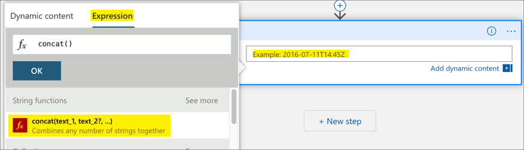
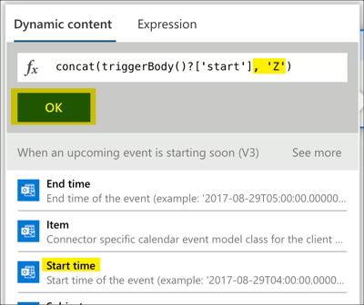

# Let your family know you are in meetings with an IoT Busy light

Like a lot of folks at the moment, I'm working for home and my child is off school.

> For those reading this in the future and wondering why, I am currently living in the time of the COVID-19 pandemic and worldwide toilet paper shortages.

One of the upsides of working from home, especially when my 7 year old is off school is that I am available most of the time for the occasional quick cuddle, to laugh at something silly she'd just done or help her with something. One of the downsides is that at any time she could walk in to my office whilst I'm on a call.


What I need is a on-air style light, to let her know when I'm in meetings and when I'm not. Luckily I'm an IoT nut so I not only have the skills to build such a thing, but I have all the parts just lying around begging me to use them! So I built one!


## What I needed it to do

This light needs to live outside my office so my family can see it before they come in, but I don't want to have to get up and walk out the door to turn it on or off. I want to have it controlled automatically by my calendar, so it shows red when I have a meeting and green when I'm free.

This leads to the problem of connectivity - how can my calendar control my light remotely. For that the answer was obvious - a mixture of [Azure IoT Central](https://azure.microsoft.com/services/iot-central/?WT.mc_id=busylight-github-jabenn), the glorious IoT SaaS platform from Microsoft, and [Azure Logic Apps](https://azure.microsoft.com/services/logic-apps/?WT.mc_id=busylight-github-jabenn), a no-code tool for building apps.  Both have such a low barrier to entry I knew I'd be able to get something up and running quickly.

## Hardware

> All the Amazon links below are affiliate links. Any money I make from these links will be donated to support families affected by COVID-19. If you don't want to use these links then search for the items directly on Amazon or buy from your local maker store or direct from the manufacturers.

Every good maker project starts with hardware. I needed a device I could program, some lights and something to put it in. After digging around in my supply of bits I put together the following:

* [Pimoroni Mood Light](https://amzn.to/2TMqckO) - this is a nice little kit that contains a Raspberry Pi Zero W, a Pimoroni unicorn pHAT with 55 programmable LEDs in a rectangle, some laser cut plastic to make a case that looks like a light, and various cables and headers.

* [16GB SD Card](https://amzn.to/38L5VAk) - the mood light doesn't come with an SD Card, so you'll need one to run the code from.

The Pimoroni mood light is a great all-in-one package for a light, but any Raspberry Pi would work as long as it has internet connectivity. If you want to get the Pi parts separately and make your own enclosure, then you will need:

* [Raspberry Pi Zero W](https://amzn.to/3cRtfj7) - the W part is important as it needs internet connectivity

* [Headers for the Pi](https://amzn.to/2wV1uWh) - the kit linked above includes them, but if you buy a board on it's own you will need the headers

* [Pimoroni Unicorn pHAT](https://amzn.to/2U02HUl) - this is a grid of 55 programmable LEDs that you can control from the Pi

One of the downsides to a make like this is it involves the bane of my existence - a soldering iron...

The Pi Zero doesn't come with headers pre-soldered unless you are lucky enough to track down one that does. The Unicorn pHAT also needs to be soldered. If you don't have a soldering iron, nows the time to buy one and learn. Be warned, the headers are small and fiddly, so you may also need a magnifier to help you.

If you are new to soldering, some great videos to help you are from EEVblog:

* [Soldering tutorial Part 1 - tools](https://youtu.be/J5Sb21qbpEQ)
* [Soldering tutorial Part 2](https://youtu.be/fYz5nIHH0iY)
* [Soldering tutorial Part 3](https://youtu.be/b9FC9fAlfQE)

You can also use a different Pi such as the new [Raspberry Pi 4](https://amzn.to/2xziEt7), and these have the headers already on the board. There are also many different light options you could use, so work with whatever you have, but you'll have to work out the code to use them yourself.

## Configure IoT Central

My favorite IoT cloud service is [Azure IoT Central](https://azure.microsoft.com/services/iot-central/?WT.mc_id=busylight-github-jabenn). This is a software as a service (SaaS) platform that allows devices to send data to and be controlled from the cloud. I can use this to send commands to the device to change the color of the light. I can also use to cache the current color so that if the device resets, it can retain it's previous color setting.

### Set up the IoT Central app

1. Head to [aka.ms/BusyLightTemplate](https://aka.ms/BusyLightTemplate). This link is to a pre-configured application template that you can use to create the IoT Central application

1. You may be prompted to sign in, so sign in with your Microsoft account. If you don't have one you can create one during this step. A Microsoft account can be created with an email address from any provider, it doesn't just have to be hotmail or outlook.

1. Give the application a name and a URL. The URL will need to be globally unique across all IoT central apps so add something personal or leave the auto-generated name.

1. Select a pricing plan. You can have a free plan for 7 days without an Azure account, or a standard plan using an Azure account. Every account has 2 devices for free, so as long as you are only using 1 or 2 devices then you will never have to pay.

    You will need an Azure subscription for a later step, and you can sign up for free:

    * If you are a student aged 18 and up and have an email address from an academic institution, you can sign up for the free Azure for Students offer at [azure.microsoft.com/free/students](https://azure.microsoft.com/free/students/?WT.mc_id=busylight-github-jabenn) without a credit card. At the time of writing this gives you $100 of credit to use over 12 months, as well as free tiers of a number of services for that 2 months. At the end of the 12 months, if you are still a student you can renew and get another $100 in credit and 12 months of free services.

    * If you are not a student, you can sign up at [azure.microsoft.com/free](https://azure.microsoft.com/free/?WT.mc_id=busylight-github-jabenn). You will need a credit card for verification purposes only, you will not be billed unless you decide to upgrade your account to a paid offering. At the time of writing the free account will give you US$200 of free credit to spend on what you like in the first 30 days, 12 months of free services, plus a load of services that have tiers that are always free.

    If you go with a standard plan, select your *Directory*, *Azure subscription* and the *Location* nearest to you.

    If you go with the free plan, enter your contact information.

1. Select **Create**

The IoT Central app will be provisioned and the dashboard will be loaded.

### Create a device

The app that is created contains everything you need to get going - except a configured device. From this app you can configure one or more devices and control these.

1. Select **Devices** from the left-hand menu

1. Select *Busy Light* from the **Devices** list

1. Select **+ New** from the top menu

1. Give the device a name and an Id, then select **Create**

1. Select the newly created device, then select **Connect** from the top menu. This will show some connection values.

1. Take a note of the *ID scope*, *Device ID* and *Primary key*

    

Repeat this for as many devices as you want to control.

## Program the Pi

The device will be running some Python code that can control the Unicorn pHAT as well as talk to IoT Central.

### Set up the Pi

The Pi needs to be running Raspbian Lite

1. Configure Rasbian Lite on the SD card by following instructions here: [raspberrypi.org/documentation/installation/installing-images](https://www.raspberrypi.org/documentation/installation/installing-images/)

1. Once the image has been burned, open it in your file explorer or Finder. It will be mounted as a drive called `BOOT`. You may need to eject the re-insert the SD card to make it visible after burning.

1. Create an empty file in the root of the drive called `ssh` with no extension. This file should be empty, the presence of a file called `ssh` is enough to enable SSH on the Pi.

1. Create a new file in the root of the drive called `wpa_supplicant.conf`. This file contains the WiFi connection details. Add the following to this file:

    ```sh
    ctrl_interface=DIR=/var/run/wpa_supplicant GROUP=netdev
    update_config=1
    country=US

    network={
        ssid="YOURSSID"
        psk="YOURPASSWORD"
        scan_ssid=1
    }
    ```

    Replace `YOURSSID` and `YOURPASSWORD` with the SSID and password of your WiFi.

1. Eject the SD card and insert it into your Raspberry Pi.

1. Power up the Pi. It should only take a few seconds to boot, and whilst this is happening you will see the LED by the power socket flash.

1. Test the connection by SSHing into your Pi. From your computer connect to `pi@raspberrypi.local`.

    ```sh
    ssh pi@raspberrypi.local
    ```

    If the host cannot be found then if you know the IP address (for example by using your routers management software) then you can log in to `pi@192.168.0.1`, replacing `192.168.0.1` with the IP address of your Pi. You can also use the [Adafruit Pi Finder utility](https://learn.adafruit.com/the-adafruit-raspberry-pi-finder/finding-and-connecting) to locate it's IP address.

    The default password is `raspberry`.

### Install the light controller software

The light controller software is in this repo in the [`app.py`](./app.py) file. This contains code to talk to IoT Central to receive commands to change the light color, then set this color on the Unicorn pHAT. For this script to connect to IoT central some environment variables need to be configured in a file.

1. Run the install script using this command:

    ```sh
    bash -c "$(curl -s -L https://github.com/jimbobbennett/BusyLight/releases/download/v0.1/install.sh)"
    ```

    This will update the Pi, install libraries for the Unicorn pHAT, the Python code for this app, and configure the CronTab to run this app when the device reboots. You may need to select 'y' one or more times when prompted.

1. When prompted enter the values for the *ID scope*, *Device ID* and *Primary Key* copied from the IoT Central device connection dialog

1. The app will be installed in the `BusyLight` folder in the home directory

1. After installation, the device will reboot and you will be disconnected from the SSH session. When the Pi reboots the app will be running.

> If you are using a different light than the Unicorn pHAT you will need to install the relevant libraries yourself and update the code. The code is in the `~/BusyLight/app.py` file.
>
> You will need to remove all references to the `unicornhat` module and the calls to set it up. Then update the `set_color` function to use your preferred lights. This function is passed the color as an RGB HEX string, the first 2 characters are the hex value to set for the red channel, second two are the hex value for the green channel and last two the hex values for the blue channel.

### Test the light

The light is now ready to be controlled from IoT Central.

1. Head to your IoT Central app in your browser

1. Select **Devices** from the left-hand menu, then select your device

1. You will see a dashboard with 2 cells - one showing the current color, then other labelled **Update Colour**. Select the **Update Colour** cell.

    

1. Enter a value for the **Colour** using a 6-character HEX string for RGB values. For example, for red enter `FF000`, green is `00FF00`, blue is `0000FF`, white is `FFFFFF` and off is `000000`

1. Select **Run**

The light should change to match the color specific. Try with a few different colours.

If you return to the dashboard, you will see the value of the **Colour** cell updated to show the value sent to the light. This value is read by the app every time it restarts to ensure that the light keeps its color between restarts.

## Connect my calendar to control the device

Finally my light needs to be controlled. I want it to turn red automatically when a meeting starts, then turn green when it ends. This can be done using Azure Logic Apps.

Azure logic apps are not free, but are *VERY* cheap for small numbers of runs. For example at the time of writing, a single run on a logic app is $0.000025 per action, so to poll for meetings every 10 minutes each day might cost $0.50 a month.

> In this I cover using Logic Apps to connect to my Office 365 calendar, but you can use these to control IoT Central triggered by a number of different things such as:
>
> * A web request - this can then be called by a device such as a Flic button
> * A timer to turn the light on and off based of a normal work day
> * Azure dev ops - turn the light red when a work item is assigned

### Create the logic app

1. Open the Azure Portal at [portal.azure.com](https://portal.azure.com/?WT.mc_id=busylight-github-jabenn)

1. Log in if you need to using your Microsoft account. If you don't have an Azure account follow the [instructions above](https://github.com/jimbobbennett/BusyLight/tree/master#set-up-the-iot-central-app) to create one.

1. Select **+ Create a resource**

1. Search for `Logic App`, select it then select **Create**

1. Select your Azure subscription

1. For the *Resource group* select **Create new** and name the new resource group **BusyLight**

    > Resource groups are logical groupings of Azure services, allowing you to manage all the services for a particular application or project together.

1. Name the logic app `CalendarControl`

1. Select the *location* closest to you

1. Select **Review + create**, then **Create**

The logic app will be created, and when it is ready select **Go to resource**

### Program the logic app

Logic apps are no-code apps where you can connect triggers to actions, and these can connect to external services such as Office365 and IoT Central. I want mine connected to my Office365 calendar to poll for upcoming events, and if it finds any schedule calls to IoT Central to execute the **Update Colour** command.

#### Create a trigger

1. When you first open the Logic App it will take you to the designer. From the *Templates* section, select **Blank logic app**

1. Search the connectors and triggers for `office 365 outlook` and select the **Office 365 Outlook** connector

1. Select the **When an upcoming event is starting soon** trigger

1. The designer will show the new trigger. Select **Sign In** and sign in with your Office 365 account.

1. Select your calendar in the *Calendar Id* drop down

    > If you have multiple calendars to check, you will need to create multiple Logic Apps.

1. Leave the look ahead time at 15 minutes

1. Set an appropriate interval to poll for new items. Depending on how far in advance meetings can added to your calendar you can choose a suitable interval, as you pay for each poll. I use 10 minutes as I don't get meetings appearing in my calendar with less notice than that.

    > This value needs to be less than the look ahead time otherwise events might be missed

#### Wait till the event starts

The trigger is fired when it sees an upcoming event, so the app needs to delay till the event actually starts before changing the light to red. Logic app triggers and actions can pass data between them, so the Office 365 connector can pass the start and end times to the next action in the app.

There is a small snag however - date and time formats are hard! The date format passed from the Office connector is not quite right for the one expected by the delay actions, so needs to be adjusted.

1. Select **+ New step**

1. Search for `Schedule` and select **Schedule**

1. Select the **Delay until** action

1. Select the *Timestamp* value and a box should pop up allowing you to build an expression

1. Select the **Expression** tab, then select **Concat**

    

1. Select the **Dynamic content** tab and select **Start time**. If you can't see this, select **See more** from the top of the list.

1. Select the expression, and add `, 'Z'` before the last bracket. The select **OK**.

    

#### Execute the IoT Central command to change the light color

The delay will hold till the meeting is about to start, so the next step is to connect to IoT Central to execute the command. To do this, you will need the IoT Central application Id and device Id.

1. Open your IoT Central app

1. Select **Administration** from the left-hand menu

1. Select **Your application** from the *Administration* menu

1. Take a note of the *Application ID*

1. Select **Devices** from the left-hand menu

1. Take a note of the *Device Id* of your device

Once you have this Id, you can create the connector

1. Head back to your logic app

1. Select **+ New step**

1. Search for `Azure IoT Central`, then select **Azure IoT Central**

1. Select the **Run a command** action

1. Once the action appears, select **Sign in** and log in with your Azure account if required

1. Drop down the *Application* box and select **Enter custom value**

1. Enter in the Application ID you noted down earlier

1. Drop down the *Device Template* and select `Busy Light (1.0.0)`

1. Enter your device id in the *Device* box

1. Drop down the *Command* and select `Update Colour`

1. Drop down *Add a new parameter* and check the box next to **Colour**

1. Set the value of *Colour* to be the colour you want when you are in a meeting, using a 6 character RGB hex string. For example, for red enter `FF0000`

#### Handle the event ending

Repeat the two steps above to add another Delay Until and Run a Command action to the app. The second delay should use the *End time* instead of the *Start time*, and for the colour use the colour you want when you are not in a meeting, such as `00FF00` for green.

#### Save the logic app

1. Select **Save** from the Logic App designer menu to save the Logic App and enable it

#### Test the logic app

Add an upcoming event to your calendar - far enough away that the poll will be run once. Your light will turn red when the event starts and green when it finishes.

## Next steps

I also added a [Flic button](https://amzn.to/3aRYlpe) to control the light, in case of impromptu meetings or if a meeting ends early (Yay!). To do this I set up three Logic Apps with HTTP triggers and actions calls the IoT Central command passing different colors - red, green and off (000000). I then connected these to the Flic button, so one click for red, two for green and hold to turn the light off.

## Learn more

If you want to learn more about Azure IoT and AI services, the best place to start is Microsoft Learn - our free on-line, self guided hands on learning experience.

* [IoT Learning Paths on Microsoft Learn](https://docs.microsoft.com/learn/browse/?term=IOT&WT.mc_id=busylight-github-jabenn)
* [Logic app learning paths on Microsoft Learn](https://docs.microsoft.com/learn/browse/?term=logic%20apps&WT.mc_id=busylight-github-jabenn)
