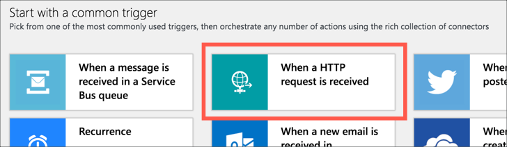

# Control the lights from a smart button

The lights can be controlled from a [Flic button](https://amzn.to/3aRYlpe), in case of impromptu meetings or if a meeting ends early (Yay!). You can also use this button to turn the lights off when you finish for the day.

> You don't have to use a Flic button, the logic apps you will create will be controlled from HTTP requests, so any smart button or other device that can make web requests will work.

To do this I created three logic apps, one to turn the light red, one for green and another for off.

## Create the logic app to turn the light red

1. Open the Azure Portal at [portal.azure.com](https://portal.azure.com/?WT.mc_id=busylight-github-jabenn)

1. Log in if you need to using your Microsoft account. If you don't have an Azure account follow the [instructions above](https://github.com/jimbobbennett/BusyLight/blob/master/steps/configure-iot-central.md#set-up-the-iot-central-app) to create one.

1. Select **+ Create a resource**

1. Search for `Logic App`, select it then select **Create**

1. Select your Azure subscription

1. For the *Resource group* select **Create new** and name the new resource group **BusyLight**

    > Resource groups are logical groupings of Azure services, allowing you to manage all the services for a particular application or project together.

1. Name the logic app `LightControl-Red`

1. Select the *location* closest to you

1. Select **Review + create**, then **Create**

The logic app will be created, and when it is ready select **Go to resource**

## Create a trigger

1. When you first open the Logic App it will take you to the designer. From the *Start with a common trigger* section, select **When a HTTP request is received**.

    

The HTTP URL to run the trigger will be generated after the logic app is complete and saved.

### Execute the IoT Central command to change the light color

The next step is to connect to IoT Central to execute the command. To do this, you will need the IoT Central application Id and device Id.

1. Open your IoT Central app

1. Select **Administration** from the left-hand menu

1. Select **Your application** from the *Administration* menu

1. Take a note of the *Application ID*

1. Select **Devices** from the left-hand menu

1. Take a note of the *Device Id* of your device

Once you have this Id, you can create the connector

1. Head back to your logic app

1. Select **+ New step**

1. Search for `Azure IoT Central`, then select **Azure IoT Central**

1. Select the **Run a command** action

1. Once the action appears, select **Sign in** and log in with your Azure account if required

1. Drop down the *Application* box and select **Enter custom value**

1. Enter in the Application ID you noted down earlier

1. Drop down the *Device Template* and select `Busy Light (1.0.0)`

1. Enter your device id in the *Device* box

1. Drop down the *Command* and select `Update Colour`

1. Drop down *Add a new parameter* and check the box next to **Colour**

1. Set the value of *Colour* to be red using a 6 character RGB hex string by entering `FF0000`

## Save the logic app

1. Select **Save** from the Logic App designer menu to save the Logic App and enable it.

## Test the logic app

1. Expand the HTTP trigger in the logic app designer

1. Select the **Copy URL** button next to the HTTP request URL

1. Paste the URL into a new browser window and press return to execute the request

1. The light should turn red.

## Set up other colors

Repeat the above steps for two more logic apps, called `LightControl-Green` and `LightControl-Off`. Set the green logic app to set the color to green (`00FF00`), and the off logic app to turn the lights off (`000000`).

## Connect to the Flic button

Using the Flic app on your phone, configure the button to execute the HTTP request URLs for the three different logic apps. I set mine up to turn red for a single click, green for a double click, and off on hold.

In this step you created an Azure Logic app to control the lights from a Flic button. [Check out the other trigger options](./connect-logic-app.md).
