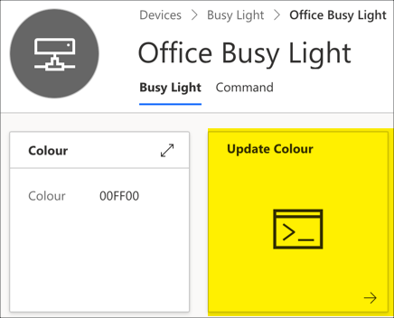

# Install the Pi software

In the [previous step](./configure-iot-central.md) you set up Azure IoT Central to control the device. In this step you will install the software on the Pi.

## Set up the Pi

The Pi needs to be running Raspbian Lite

1. Configure Rasbian Lite on the SD card by following instructions here: [raspberrypi.org/documentation/installation/installing-images](https://www.raspberrypi.org/documentation/installation/installing-images/)

1. Once the image has been burned, open it in your file explorer or Finder. It will be mounted as a drive called `BOOT`. You may need to eject the re-insert the SD card to make it visible after burning.

1. Create an empty file in the root of the drive called `ssh` with no extension. This file should be empty, the presence of a file called `ssh` is enough to enable SSH on the Pi.

1. Create a new file in the root of the drive called `wpa_supplicant.conf`. This file contains the WiFi connection details. Add the following to this file:

    ```sh
    ctrl_interface=DIR=/var/run/wpa_supplicant GROUP=netdev
    update_config=1
    country=US

    network={
        ssid="YOURSSID"
        psk="YOURPASSWORD"
        scan_ssid=1
    }
    ```

    Replace `YOURSSID` and `YOURPASSWORD` with the SSID and password of your WiFi.

1. Eject the SD card and insert it into your Raspberry Pi.

1. Power up the Pi. It should only take a few seconds to boot, and whilst this is happening you will see the LED by the power socket flash.

1. Test the connection by SSHing into your Pi. From your computer connect to `pi@raspberrypi.local`.

    ```sh
    ssh pi@raspberrypi.local
    ```

    If the host cannot be found then if you know the IP address (for example by using your routers management software) then you can log in to `pi@192.168.0.1`, replacing `192.168.0.1` with the IP address of your Pi. You can also use the [Adafruit Pi Finder utility](https://learn.adafruit.com/the-adafruit-raspberry-pi-finder/finding-and-connecting) to locate it's IP address.

    The default password is `raspberry`.

1. Change the password from the default using the following command:

    ```sh
    passwd
    ```

    Enter the current password, then a new password, then confirm the new password.

## Install the light controller software

The software for the Pi is slightly different, depending on what light you are using.

### Mood light or Unicorn pHAT

> The mood light uses a Unicorn pHAT, so you can use the same software if you are using the mood light, or just a Unicorn pHAT on it's own.

The light controller software for the Unicorn pHAT is in this repo in the [`app-unicornhat.py`](../app/app-unicornhat.py) file. This contains code to talk to IoT Central to receive commands to change the light color, then set this color on the Unicorn pHAT. For this script to connect to IoT central some environment variables need to be configured in a file.

1. Run the install script using this command:

    ```sh
    bash -c "$(curl -s -L https://github.com/jimbobbennett/BusyLight/releases/download/v0.2/install-unicornhat.sh)"
    ```

    This will update the Pi, install libraries for the Unicorn pHAT, the Python code for this app, and configure the CronTab to run this app when the device reboots. You may need to select 'y' one or more times when prompted.

1. When prompted enter the values for the *ID scope*, *Device ID* and *Primary Key* copied from the IoT Central device connection dialog

1. The app will be installed in the `BusyLight` folder in the home directory

1. After installation, the device will reboot and you will be disconnected from the SSH session. When the Pi reboots the app will be running.

### Blinkt

The light controller software for the Blinkt is in this repo in the [`app-blinkt.py`](../app/app-blinkt.py) file. This contains code to talk to IoT Central to receive commands to change the light color, then set this color on the Unicorn pHAT. For this script to connect to IoT central some environment variables need to be configured in a file.

1. Run the install script using this command:

    ```sh
    bash -c "$(curl -s -L https://github.com/jimbobbennett/BusyLight/releases/download/v0.2/install-blinkt.sh)"
    ```

    This will update the Pi, install libraries for the Unicorn pHAT, the Python code for this app, and configure the CronTab to run this app when the device reboots. You may need to select 'y' one or more times when prompted.

1. When prompted enter the values for the *ID scope*, *Device ID* and *Primary Key* copied from the IoT Central device connection dialog

1. The app will be installed in the `BusyLight` folder in the home directory

1. After installation, the device will reboot and you will be disconnected from the SSH session. When the Pi reboots the app will be running.

### Different lights

If you are using a different light than the Unicorn pHAT you will need to install the relevant libraries yourself and update the code. The code is in the `~/BusyLight/app-unicornhat.py` file.

You will need to remove all references to the `unicornhat` module and the calls to set it up. Then update the `set_color` function to use your preferred lights. This function is passed the color as an RGB HEX string, the first 2 characters are the hex value to set for the red channel, second two are the hex value for the green channel and last two the hex values for the blue channel.

## Test the light

The light is now ready to be controlled from IoT Central.

1. Head to your IoT Central app in your browser

1. Select **Devices** from the left-hand menu, then select your device

1. You will see a dashboard with 2 cells - one showing the current color, then other labelled **Update Colour**. Select the **Update Colour** cell.

    

1. Enter a value for the **Colour** using a 6-character HEX string for RGB values. For example, for red enter `FF000`, green is `00FF00`, blue is `0000FF`, white is `FFFFFF` and off is `000000`

1. Select **Run**

The light should change to match the color specific. Try with a few different colours.

If you return to the dashboard, you will see the value of the **Colour** cell updated to show the value sent to the light. This value is read by the app every time it restarts to ensure that the light keeps its color between restarts.

<hr>

In this step you installed the software on the Pi. In the [next step](./connect-logic-app.md) you will connect an Azure Logic App to control the lights.
